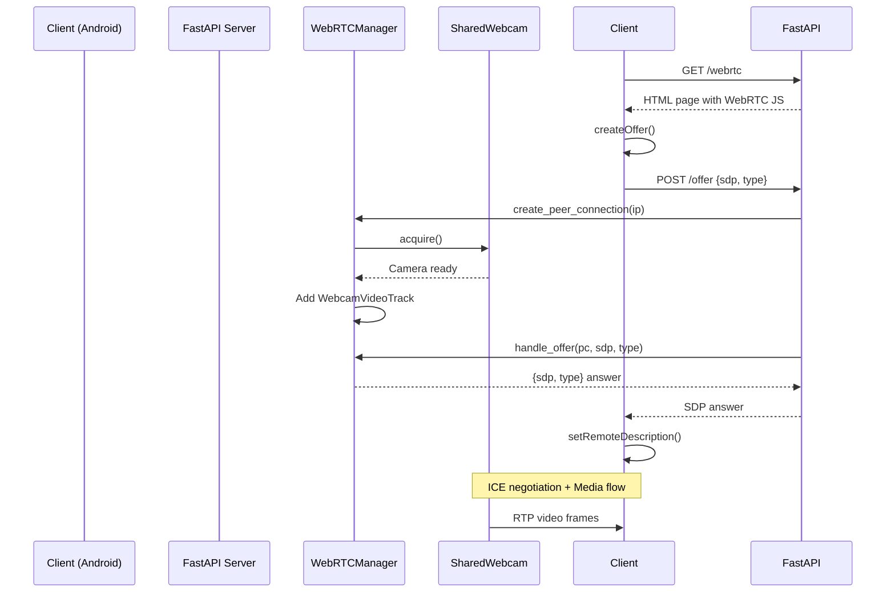

# Architecture du Service Caméra WebRTC

## Vue d'ensemble

Le service caméra a été refactoré en **2 modules distincts** pour une meilleure séparation des responsabilités:

```
service caméra/
├── webrtc_core.py           # Module métier WebRTC
└── webrtc_server_fastapi.py # Serveur web FastAPI
```

## Module webrtc_core.py (Logique métier)

Ce module contient toute la logique WebRTC sans aucune dépendance HTTP.

### Classes principales

#### 1. SharedWebcam
Gestion thread-safe de la caméra avec compteur de références.

```python
webcam = SharedWebcam(
    camera_index=0,
    width=1280,
    height=720,
    fps=20
)
```

**Méthodes:**
- `acquire()` - Active la caméra (incrémente compteur)
- `release()` - Libère la caméra (décrémente compteur)
- `read()` - Lit une frame de la caméra

#### 2. WebcamVideoTrack
Track vidéo WebRTC compatible aiortc (hérite de `VideoStreamTrack`).

**Fonctionnalités:**
- Streaming RTP avec horloge 90kHz
- Pacing automatique selon FPS configuré
- Fallback sur frame noire si caméra inaccessible
- Gestion automatique de la lifecycle caméra

#### 3. WebRTCManager
Gestionnaire de peer connections WebRTC.

```python
manager = WebRTCManager(
    webcam=webcam,
    fps=20,
    debug=True
)
```

**Méthodes:**
- `create_peer_connection(remote_ip)` - Crée une RTCPeerConnection avec track vidéo
- `handle_offer(pc, sdp, type)` - Traite l'offre SDP et retourne l'answer
- `close_all()` - Ferme toutes les connexions actives

**Fonctionnalités:**
- Gestion automatique des anciennes connexions (1 par IP)
- Logs ICE candidates pour debug
- Monitoring des états de connexion
- Configuration ICE sans STUN (réseau local)

## Module webrtc_server_fastapi.py (Serveur web)

Serveur HTTP FastAPI simplifié qui délègue la logique WebRTC au module core.

### Endpoints

#### GET /
Informations sur le serveur

#### GET /health
Health check

#### GET /webrtc
Page HTML avec client WebRTC (lecteur vidéo)

#### POST /offer
Signaling WebRTC - négocie la connexion

**Request:**
```json
{
  "sdp": "v=0\no=...",
  "type": "offer"
}
```

**Response:**
```json
{
  "sdp": "v=0\no=...",
  "type": "answer"
}
```

#### POST /control/{direction}
Commandes directionnelles (up/down/left/right)

**Response:**
```json
{
  "status": "ok",
  "direction": "up"
}
```

### Configuration

Variables d'environnement:

```powershell
$env:HOST = "0.0.0.0"
$env:PORT = "8090"
$env:CAMERA_INDEX = "0"
$env:WIDTH = "1280"
$env:HEIGHT = "720"
$env:FPS = "20"
$env:DEBUG = "1"  # Active les logs détaillés
```

## Workflow de connexion



## Avantages de cette architecture

### ✅ Séparation des responsabilités
- **webrtc_core.py**: Logique métier réutilisable
- **webrtc_server_fastapi.py**: Interface HTTP uniquement

### ✅ Testabilité
Le module core peut être testé indépendamment sans serveur web.

### ✅ Réutilisabilité
Le module core peut être importé dans d'autres projets (CLI, autres serveurs, etc.)

### ✅ Maintenance
- Code plus court et lisible
- Responsabilités claires
- Modifications isolées

### ✅ Extensibilité
Facile d'ajouter:
- Nouveaux endpoints FastAPI
- Nouveaux types de tracks (audio, data channels)
- D'autres serveurs (aiohttp, Flask, etc.)

## Dépendances

```txt
fastapi==0.104.1
uvicorn==0.24.0
aiortc==1.9.0
opencv-python==4.8.1.78
av==13.1.0
numpy
```

## Lancement

### Méthode 1: PowerShell script
```powershell
.\run_fastapi.ps1 -Port 8090 -Debug
```

### Méthode 2: Direct
```powershell
python webrtc_server_fastapi.py
```

### Méthode 3: uvicorn
```powershell
uvicorn webrtc_server_fastapi:app --host 0.0.0.0 --port 8090
```

## Debug

Activer les logs détaillés:

```powershell
$env:DEBUG = "1"
python webrtc_server_fastapi.py
```

Logs affichés:
- Candidats ICE (client + serveur)
- États de connexion WebRTC
- Commandes directionnelles reçues
- Lifecycle des peer connections

## Notes réseau

### Configuration ICE
```python
iceServers: []  # Pas de STUN/TURN
```

Cette configuration fonctionne **uniquement sur réseaux locaux** sans nécessiter d'accès internet.

### Problème mDNS
Chrome/WebView utilisent mDNS qui génère des candidats `.local` qu'aiortc ne peut pas résoudre.

**Solution:** Désactiver mDNS dans Chrome flags:
```
chrome://flags/#enable-webrtc-hide-local-ips-with-mdns
```

### Ports requis
- **TCP 8090**: Serveur HTTP/WebSocket
- **UDP 1024-65535**: Médias WebRTC (RTP)
